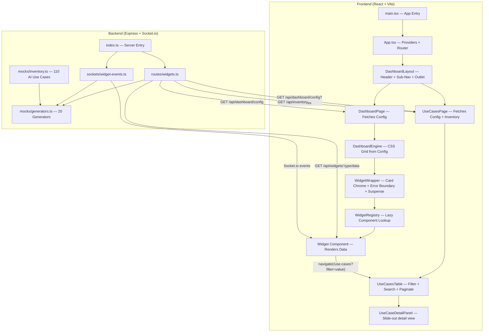

# Command Center — Architecture Walkthrough

## Monorepo Structure

```
command-center/                    ← TurboRepo root
├── apps/
│   ├── client/                    ← React (Vite) frontend
│   └── server/                    ← Express + Socket.io backend
│       └── src/mocks/
│           ├── inventory.ts       ← 110 AI Use Case items (centralized mock DB)
│           └── generators.ts      ← 20 generator functions (derive from inventory)
├── packages/
│   ├── types/                     ← Shared TypeScript types (@command-center/types)
│   │   └── src/inventory.ts       ← AIUseCaseItem interface + union types
│   └── tsconfig/                  ← Shared TS config
├── turbo.json
└── pnpm-workspace.yaml
```

The `@command-center/types` package is the **single source of truth** for data shapes — both the server (mock generators) and client (hooks, widgets) import from it.

---

## How Everything is Connected — The Full Stack



---

## Data Flow — Step by Step

### 1. App Bootstrap

[main.tsx](file:///Users/nikokonovalov/Git/command-center/apps/client/src/main.tsx) renders `<App />` into the DOM.

[App.tsx](file:///Users/nikokonovalov/Git/command-center/apps/client/src/App.tsx) wraps the app in three layers:

| Layer | File | Purpose |
|-------|------|---------|
| **QueryProvider** | [QueryProvider.tsx](file:///Users/nikokonovalov/Git/command-center/apps/client/src/providers/QueryProvider.tsx) | TanStack Query client (30s stale time, 2 retries) |
| **SocketProvider** | [SocketProvider.tsx](file:///Users/nikokonovalov/Git/command-center/apps/client/src/providers/SocketProvider.tsx) | Global Socket.io singleton → React context |
| **BrowserRouter** | react-router-dom | Routes: `/` → `/dashboard`, `/risk`, `/use-cases` |

### 2. Layout Shell

[DashboardLayout.tsx](file:///Users/nikokonovalov/Git/command-center/apps/client/src/layouts/DashboardLayout.tsx) renders the **global header** (Citi branding + notifications) and **sub-navigation** (three tab links), with an `<Outlet />` where page content is injected.

**Routes:**
| Path | Page | Description |
|------|------|-------------|
| `/dashboard` | `DashboardPage` | AI Lifecycle Management tab |
| `/risk` | `RiskDashboardPage` | AI Risk & Compliance tab |
| `/use-cases` | `UseCasesPage` | All AI Use Cases table tab |

### 3. Dashboard Config Fetching

[DashboardPage.tsx](file:///Users/nikokonovalov/Git/command-center/apps/client/src/pages/DashboardPage.tsx) is the key orchestrator. On mount it:

1. Calls `GET /api/dashboard/config` via TanStack Query (`staleTime: Infinity`)
2. Server responds with a [DashboardConfig](file:///Users/nikokonovalov/Git/command-center/packages/types/src/dashboard.ts) — an array of [WidgetConfig](file:///Users/nikokonovalov/Git/command-center/packages/types/src/dashboard.ts#10-17) objects
3. If the API is unreachable, falls back to the static [dashboard.config.ts](file:///Users/nikokonovalov/Git/command-center/apps/client/src/config/dashboard.config.ts)
4. Passes the resolved config to `<DashboardEngine />`

> [!IMPORTANT]
> The dashboard layout is **server-driven**. The backend decides *which* widgets appear, their *order*, *grid spans*, and *data sources*. The frontend just renders whatever config it receives.

### 4. Engine — Config-Driven Rendering

[DashboardEngine.tsx](file:///Users/nikokonovalov/Git/command-center/apps/client/src/engine/DashboardEngine.tsx) reads `config.widgets` and renders a **CSS Grid** (`grid-cols-4, auto-rows-[180px]`). For each widget config, it creates a grid cell with the correct `colSpan`/`rowSpan` and mounts a `<WidgetWrapper />`.

### 5. WidgetWrapper — The "Chrome" Layer

[WidgetWrapper.tsx](file:///Users/nikokonovalov/Git/command-center/apps/client/src/engine/WidgetWrapper.tsx) wraps every widget in:
- **Card UI** — rounded border, title header, "Live" indicator for socket widgets
- **`<Suspense>`** — shows a skeleton while the lazy component loads
- **`<WidgetErrorBoundary>`** — catches crashes, shows a Retry button

It looks up the widget's React component from the **WidgetRegistry**.

### 6. WidgetRegistry — The Type→Component Map

[WidgetRegistry.ts](file:///Users/nikokonovalov/Git/command-center/apps/client/src/engine/WidgetRegistry.ts) maps the `type` string from the config (e.g. `"stats-card"`) to a **lazily-loaded** React component:

```typescript
'stats-card':  lazy(() => import('@/widgets/stats-card')),
'live-users':  lazy(() => import('@/widgets/live-users')),
// ...etc
```

### 7. Widget Components — "Dumb" Renderers

Each widget receives a `dataSource` prop and uses one of two hooks to get data:

| Data Source Type | Hook | File |
|-----------------|------|------|
| `rest` | `useWidgetQuery<T>()` | [useWidgetQuery.ts](file:///Users/nikokonovalov/Git/command-center/apps/client/src/hooks/useWidgetQuery.ts) — wraps TanStack Query |
| `socket` | `useWidgetSocket<T>()` | [useWidgetSocket.ts](file:///Users/nikokonovalov/Git/command-center/apps/client/src/hooks/useWidgetSocket.ts) — subscribes to a Socket.io room |

---

## All AI Use Cases Tab

The third navigation tab (`/use-cases`) is a fully server-driven inventory table with filtering, searching, pagination, and a slide-out detail panel.

### Data Flow

1. [UseCasesPage.tsx](file:///Users/nikokonovalov/Git/command-center/apps/client/src/pages/UseCasesPage.tsx) fetches two things in parallel via TanStack Query:
   - `GET /api/dashboard/config?tab=use-cases` → `TableConfig` (columns, filters, pagination settings)
   - `GET /api/inventory` → `AIUseCaseItem[]` (all 110 use case records)
2. Falls back to `defaultUseCasesTableConfig` from [dashboard.config.ts](file:///Users/nikokonovalov/Git/command-center/apps/client/src/config/dashboard.config.ts) if the API is unreachable
3. Passes both to `<UseCasesTable />`

### UseCasesTable — URL-Driven State

[UseCasesTable.tsx](file:///Users/nikokonovalov/Git/command-center/apps/client/src/components/use-cases/UseCasesTable.tsx) manages **all state via URL search params** (`useSearchParams` from React Router). This enables:
- Widgets on the dashboard tabs to navigate here with pre-applied filters (e.g. `/use-cases?lifecycleStage=POC`)
- Filters persist across page refresh and can be shared via URL
- "Clear All" removes all URL params at once

**URL param keys used:**

| Param | Description |
|-------|-------------|
| `lifecycleStage` | Filter by POC / Pilot / Production / Archived |
| `slaStatus` | Filter by On Track / At SLA Limit / SLA Breached |
| `aiOnboardingStage` | Filter by governance stage (partial match for comma-separated values) |
| `aiTechnology` | Filter by Agentic AI / GenAI |
| `severity` | Filter by Critical / High / Medium / Low |
| `status` | Filter by Approved / Pending / Rejected |
| `lob` | Filter by Line of Business (business unit name) |
| `search` | Full-text search across useCaseName, useCaseId, businessCaseId |
| `page` | Current page number |
| `pageSize` | Rows per page |

**Filter pipeline:** `data → filter(URL params) → filter(search query) → paginate → render`

The filter logic uses `itemValue.includes(value)` (partial match) to support the `aiOnboardingStage` field which can contain comma-separated values like `"Pending CISO, Pending MRM"`.

### TableConfig — Server-Driven Columns & Filters

The `TableConfig` type (in `@command-center/types`) drives the entire table structure:

```typescript
interface TableConfig {
    name: string;
    description?: string;
    columns: ColumnConfig[];   // Which fields to show and how to render them
    filters: FilterConfig[];   // Which dropdowns appear in the filter bar
    search?: SearchConfig;     // Searchable field keys + placeholder text
    defaultPageSize: number;
    pageSizeOptions: number[];
}
```

Columns can have a `badge` property that maps field values to semantic variants (`success`, `warning`, `danger`, `info`, `neutral`) which the table renders as colored pills.

### Clickable Widgets → Table Navigation

All Lifecycle tab widgets are wired up to navigate to `/use-cases` with pre-applied filters when clicked. The shared helper is:

**[`apps/client/src/lib/navigation.ts`](file:///Users/nikokonovalov/Git/command-center/apps/client/src/lib/navigation.ts)**
```typescript
export function buildUseCasesUrl(filters: Record<string, string>): string {
    const params = new URLSearchParams(filters);
    const qs = params.toString();
    return qs ? `/use-cases?${qs}` : '/use-cases';
}
```

Each widget imports `buildUseCasesUrl` and `useNavigate`, then attaches `onClick={() => navigate(buildUseCasesUrl({ filterKey: 'filterValue' }))}` to clickable elements.

**Widget → Filter mapping:**

| Widget | Clickable Element | Filter Applied |
|--------|-------------------|----------------|
| `lifecycle-kpi` | Each KPI card | `lifecycleStage` = POC / Pilot / Production / Archived (Total navigates with no filter) |
| `lifecycle-funnel` | Each funnel segment | `lifecycleStage` = segment label |
| `stage-timeline` | Each stage card | `lifecycleStage` = card label |
| `approval-status` | Donut segments + legend | `status` = Approved / Rejected / Pending |
| `tech-distribution` | Bar segments + legend | `aiTechnology` = Agentic AI / GenAI |
| `approval-time` | SLA status badge | `slaStatus` = badge value (with "Within SLA" → "On Track" mapping) |
| `production-growth` | Entire card | `lifecycleStage` = Production |
| `onboarding-tracker` | Donut segments + legend | `aiOnboardingStage` = segment label (partial match) |
| `bottlenecks` | "SLA Breaches" row only | `slaStatus` = SLA Breached |
| `use-cases-by-bu` | Each bar row | `lob` = business unit name |

Risk tab widgets are **not clickable** — they show agent-level derived metrics that don't map to inventory filters.

### UseCaseDetailPanel — Slide-Out Detail View

[UseCaseDetailPanel.tsx](file:///Users/nikokonovalov/Git/command-center/apps/client/src/components/use-cases/UseCaseDetailPanel.tsx) opens when the **eye icon** in the Actions column is clicked. It renders as a 700px slide-out panel from the right side of the screen.

**Behavior:**
- Rendered via `createPortal` at `document.body` to avoid table overflow clipping
- Slides in/out with a CSS `translate-x` + `transition-transform duration-300` animation
- Backdrop (`bg-black/30`) dims the page; clicking it closes the panel
- Also closes on X button, "Close" button, or Escape key
- Opening a different row's eye icon while the panel is open swaps the content immediately

**Panel sections (all derived from `AIUseCaseItem` fields — no extra API call):**

| Section | Data Source |
|---------|-------------|
| Header | `useCaseName`, `businessCaseId`, `useCaseId` |
| Badge Row | `lifecycleStage`, `aiOnboardingStage`, `slaStatus` (colored badges) |
| Assigned Reviewers | Fixed mock names (MRM Owner, CBDC Reviewer, CISO Reviewer) |
| Lifecycle Timeline | Derived from `lifecycleStage` + `daysInCurrentStage` + `expectedSlaDays`; current stage shows progress bar with SLA breach indicator, completed stages show full bar, future stages show "Not Started" |
| Governance Approval Tracker | Derived from `aiOnboardingStage` — parses the CISO/CBDC/MRM/NAC approval sequence to determine Completed / Pending / Not Started status with progress bars |
| Timeline & Audit Log | Generated mock date entries based on approval timeline |
| Footer | "View in AgentFlow" button + "Close" button |

---

## Inventory — The Centralized Data Layer

All widget data is derived from a single **inventory** of 110 AI use case entities in [mocks/inventory.ts](file:///Users/nikokonovalov/Git/command-center/apps/server/src/mocks/inventory.ts). This array mimics a future database — each object is an `AIUseCaseItem` (typed in [packages/types/src/inventory.ts](file:///Users/nikokonovalov/Git/command-center/packages/types/src/inventory.ts)).

```
inventory (110 items)
  │
  ├── generators.ts reads inventory
  │     ├── generateLifecycleKpiData()   → counts items per stage
  │     ├── generateUseCasesByBUData()   → groups by LOB
  │     ├── generateAttentionQueueData() → filters items with active alerts
  │     └── ...18 more generators
  │
  ├── routes/widgets.ts calls generators via widgetDataMap
  │
  └── routes/inventory.ts exposes GET /api/inventory
        → returns all 110 items for the UseCasesTable
```

**Distribution (approximate):**

| Dimension | Breakdown |
|-----------|-----------|
| Lifecycle Stages | POC ~48, Pilot ~27, Production ~22, Archived ~18 |
| AI Technology | Agentic AI ~41, GenAI ~69 |
| Approval Status | Approved ~93, Pending ~9, Rejected ~8 |
| LOBs | All 10 BUs (Compliance, COO, Finance, Service Ops, Internal Audit, HR, Client, Risk, Services, Technology, GLAC) |
| Active | ~45 items (Production + some Pilot) |
| With Agents | ~22 Production items with deployed agent names, drift scores, model metrics |
| With Alerts | ~7 items with active attention-queue alerts |

Each item carries fields for both the table view (third tab) and widget derivation — `businessCaseId`, `useCaseId`, `useCaseName`, `lob`, `lifecycleStage`, `slaStatus`, `severity`, `status`, `aiTechnology`, plus risk/model metrics for active items.

> [!NOTE]
> Time-series widgets (model-performance, model-quality-risk, ai-index-trend) keep historical data points as static arrays but derive the **current/latest value** from inventory averages. This is a pragmatic compromise until time-series data is added to the inventory.

---

## Backend Data Sources

### REST — [widgets.ts](file:///Users/nikokonovalov/Git/command-center/apps/server/src/routes/widgets.ts)

All widget endpoints follow the pattern `GET /api/widgets/:type/data` and are routed through a single `widgetDataMap` lookup. Each generator in [mocks/generators.ts](file:///Users/nikokonovalov/Git/command-center/apps/server/src/mocks/generators.ts) derives its data from the inventory.

| Endpoint | Generator | Derivation |
|----------|-----------|------------|
| `GET /api/dashboard/config?tab=lifecycle\|risk` | hardcoded configs | Returns [DashboardConfig](file:///Users/nikokonovalov/Git/command-center/packages/types/src/dashboard.ts) per tab |
| `GET /api/dashboard/config?tab=use-cases` | hardcoded config | Returns `TableConfig` (columns, filters, pagination) for the inventory table |
| `GET /api/inventory` | direct inventory export | Returns all 110 `AIUseCaseItem` records |
| **AI Lifecycle widgets** | | |
| `/api/widgets/lifecycle-kpi/data` | `generateLifecycleKpiData()` | Counts items per `lifecycleStage` |
| `/api/widgets/approval-time/data` | `generateApprovalTimeData()` | Averages `approvalDays` across all items |
| `/api/widgets/lifecycle-funnel/data` | `generateLifecycleFunnelData()` | Computes stage transition rates from counts |
| `/api/widgets/stage-timeline/data` | `generateStageTimelineData()` | Averages `daysInCurrentStage` per stage vs SLA |
| `/api/widgets/bottlenecks/data` | `generateBottlenecksData()` | Counts SLA breaches, high-risk pending, stuck >30 days |
| `/api/widgets/onboarding-tracker/data` | `generateOnboardingTrackerData()` | Counts pending items by CISO/CBDC/MRM/NAC |
| `/api/widgets/use-cases-by-bu/data` | `generateUseCasesByBUData()` | Groups and counts by `lob` |
| `/api/widgets/approval-status/data` | `generateApprovalStatusData()` | Percentages by `status` |
| `/api/widgets/tech-distribution/data` | `generateTechDistributionData()` | Percentages by `aiTechnology` |
| **AI Risk widgets** | | |
| `/api/widgets/risk-stats/data?index=0\|1` | `generateRiskStatsData()` | Counts active items / items with agents |
| `/api/widgets/live-risk-events/data` | `generateLiveRiskEventsData()` | Sums alerts, violations, triggers from active items |
| `/api/widgets/responsible-ai-index/data` | `generateResponsibleAIIndexData()` | Averages `responsibleAIScore` of active items |
| `/api/widgets/model-performance/data` | `generateModelPerformanceData()` | Averages `accuracy`/`latency` from agent items |
| `/api/widgets/model-quality-risk/data` | `generateModelQualityRiskData()` | Averages `hallucinationRate` from agent items |
| `/api/widgets/ai-index-trend/data` | `generateAIIndexTrendData()` | Derives current score from avg `responsibleAIScore` |
| `/api/widgets/attention-queue/data` | `generateAttentionQueueData()` | Filters items with non-null `alertType` |
| `/api/widgets/behavioral-drift/data` | `generateBehavioralDriftData()` | Filters items with agents, returns drift data |
| `/api/widgets/risk-score-breakdown/data` | `generateRiskScoreBreakdownData()` | Returns risk component breakdown per agent |

### Socket.io — [widget-events.ts](file:///Users/nikokonovalov/Git/command-center/apps/server/src/sockets/widget-events.ts)

| Event/Room | Interval | Generator | Derivation |
|-----------|----------|-----------|------------|
| `production-growth-update` | 3s | `generateProductionGrowthData()` | Counts Production items, adds random sparkline jitter |
| `monthly-cost-update` | 5s | `generateMonthlyCostData()` | Sums `monthlyCost` of active items, adds jitter |

Clients subscribe by emitting `subscribe` with a `{ room }` payload. The server uses Socket.io rooms to only push data to interested clients.

---

## Widget File Structure

```
widgets/
├── stats-card/
│   ├── StatsCard.tsx    ← Component (default export)
│   └── index.ts         ← Barrel: export { default } from './StatsCard'
├── live-users/
│   ├── LiveUsers.tsx
│   └── index.ts
├── ai-lifecycle/        ← Multi-component group (no index.ts needed)
│   ├── LifecycleKpi.tsx      ← Clickable → /use-cases?lifecycleStage=*
│   ├── LifecycleFunnel.tsx   ← Clickable → /use-cases?lifecycleStage=*
│   ├── StageTimeline.tsx     ← Clickable → /use-cases?lifecycleStage=*
│   ├── ApprovalStatus.tsx    ← Clickable → /use-cases?status=*
│   ├── ApprovalTime.tsx      ← Clickable → /use-cases?slaStatus=*
│   ├── TechDistribution.tsx  ← Clickable → /use-cases?aiTechnology=*
│   ├── ProductionGrowth.tsx  ← Clickable → /use-cases?lifecycleStage=Production
│   ├── OnboardingTracker.tsx ← Clickable → /use-cases?aiOnboardingStage=*
│   ├── Bottlenecks.tsx       ← SLA row clickable → /use-cases?slaStatus=SLA Breached
│   └── UseCasesByBU.tsx      ← Clickable → /use-cases?lob=*
├── ai-risk/
│   └── ...               ← Risk widgets (not clickable — agent-level metrics)

components/
└── use-cases/
    ├── UseCasesTable.tsx         ← URL-param filter state, table rendering
    └── UseCaseDetailPanel.tsx    ← Slide-out detail panel (portal, 700px)

lib/
└── navigation.ts                 ← buildUseCasesUrl() helper
```

---

## How to Build a New Widget

> [!TIP]
> You only touch **3 files** (+ your new widget). The engine handles everything else.

### Step 1: Define the data type

In [packages/types/src/widgets.ts](file:///Users/nikokonovalov/Git/command-center/packages/types/src/widgets.ts), add your data shape:

```typescript
export interface MyWidgetData {
    title: string;
    value: number;
}
```

Re-export it from [packages/types/src/index.ts](file:///Users/nikokonovalov/Git/command-center/packages/types/src/index.ts) if needed.

### Step 2: Create the widget component

Create `src/widgets/my-widget/MyWidget.tsx`:

```typescript
import { useWidgetQuery } from '@/hooks/useWidgetQuery';
import type { WidgetProps } from '@/engine/WidgetRegistry';
import type { MyWidgetData } from '@command-center/types';

export default function MyWidget({ dataSource }: WidgetProps) {
    const { data, isLoading } = useWidgetQuery<MyWidgetData>(dataSource);
    if (isLoading || !data) return <div className="skeleton h-full w-full" />;
    return <div>{data.title}: {data.value}</div>;
}
```

Create `src/widgets/my-widget/index.ts`:
```typescript
export { default } from './MyWidget';
```

### Step 3: Register the widget

In [WidgetRegistry.ts](file:///Users/nikokonovalov/Git/command-center/apps/client/src/engine/WidgetRegistry.ts), add one line:

```typescript
'my-widget': lazy(() => import('@/widgets/my-widget')),
```

### Step 4: Add to the dashboard config

In the server's [widgets.ts](file:///Users/nikokonovalov/Git/command-center/apps/server/src/routes/widgets.ts), add a new entry to the `dashboardConfig.widgets` array:

```typescript
{
    id: 'my-widget',
    type: 'my-widget',         // Must match the key in WidgetRegistry
    title: 'My Widget',
    layout: { colSpan: 2, rowSpan: 1 },
    dataSource: { type: 'rest', endpoint: '/api/widgets/my-widget/data' },
},
```

And add a mock data generator + endpoint for it.

### Step 5 (optional): Update the static fallback

Mirror the same entry in [dashboard.config.ts](file:///Users/nikokonovalov/Git/command-center/apps/client/src/config/dashboard.config.ts) for offline dev.

---

## Key Design Decisions

| Decision | Rationale |
|----------|-----------|
| **Server-driven config** | Dashboard layout and table columns/filters can change without deploying the frontend |
| **Widget Registry + lazy()** | Code-splitting — widgets only load when needed |
| **Error Boundary per widget** | One widget crashing doesn't take down the whole dashboard |
| **Dual data hooks** | Widgets don't care *how* data arrives (REST vs Socket) — they just call the appropriate hook |
| **Shared types package** | Single source of truth prevents API contract drift between client and server |
| **Static fallback config** | Frontend works even when the backend is down during development |
| **Centralized inventory** | All 20 generators derive from a single 110-item array — ensures cross-widget data consistency and feeds the "All AI Use Cases" table directly |
| **Inventory → Generator derivation** | Generators compute (count, average, filter, group) from inventory at call time — no hardcoded values, so adding/removing items automatically updates all widgets |
| **URL-driven table state** | `useSearchParams` for all filter/search/pagination state enables deep-linking, browser-back navigation, and cross-widget navigation into pre-filtered views |
| **Widget → Table navigation** | Clicking a dashboard card navigates to `/use-cases?filter=value` — the table reads the URL and applies the filter automatically, creating a seamless drill-down UX |
| **Portal-based detail panel** | `createPortal` renders the slide-out panel at `document.body` to avoid clipping by table `overflow-hidden` containers |
| **Client-side detail derivation** | The detail panel derives all its sections (governance tracker, lifecycle timeline) from the existing `AIUseCaseItem` fields — no extra API endpoint needed for the POC |
