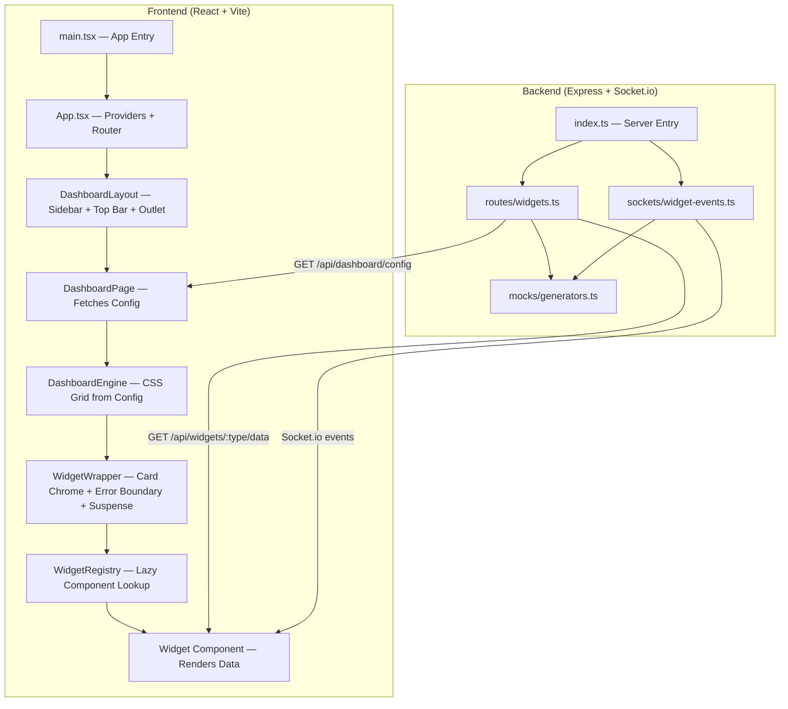

# Command Center — Architecture Walkthrough

## Monorepo Structure

```
command-center/                    ← TurboRepo root
├── apps/
│   ├── client/                    ← React (Vite) frontend
│   └── server/                    ← Express + Socket.io backend
├── packages/
│   ├── types/                     ← Shared TypeScript types (@command-center/types)
│   └── tsconfig/                  ← Shared TS config
├── turbo.json
└── pnpm-workspace.yaml
```

The `@command-center/types` package is the **single source of truth** for data shapes — both the server (mock generators) and client (hooks, widgets) import from it.

---

## How Everything is Connected — The Full Stack



---

## Data Flow — Step by Step

### 1. App Bootstrap

[main.tsx](file:///Users/nikokonovalov/Git/command-center/apps/client/src/main.tsx) renders `<App />` into the DOM.

[App.tsx](file:///Users/nikokonovalov/Git/command-center/apps/client/src/App.tsx) wraps the app in three layers:

| Layer | File | Purpose |
|-------|------|---------|
| **QueryProvider** | [QueryProvider.tsx](file:///Users/nikokonovalov/Git/command-center/apps/client/src/providers/QueryProvider.tsx) | TanStack Query client (30s stale time, 2 retries) |
| **SocketProvider** | [SocketProvider.tsx](file:///Users/nikokonovalov/Git/command-center/apps/client/src/providers/SocketProvider.tsx) | Global Socket.io singleton → React context |
| **BrowserRouter** | react-router-dom | Route: `/` redirects → `/dashboard` |

### 2. Layout Shell

[DashboardLayout.tsx](file:///Users/nikokonovalov/Git/command-center/apps/client/src/layouts/DashboardLayout.tsx) renders the **fixed sidebar** (nav links) and **top bar** (title + notification bell), with an `<Outlet />` where page content is injected.

### 3. Dashboard Config Fetching

[DashboardPage.tsx](file:///Users/nikokonovalov/Git/command-center/apps/client/src/pages/DashboardPage.tsx) is the key orchestrator. On mount it:

1. Calls `GET /api/dashboard/config` via TanStack Query (`staleTime: Infinity`)
2. Server responds with a [DashboardConfig](file:///Users/nikokonovalov/Git/command-center/packages/types/src/dashboard.ts) — an array of [WidgetConfig](file:///Users/nikokonovalov/Git/command-center/packages/types/src/dashboard.ts#10-17) objects
3. If the API is unreachable, falls back to the static [dashboard.config.ts](file:///Users/nikokonovalov/Git/command-center/apps/client/src/config/dashboard.config.ts)
4. Passes the resolved config to `<DashboardEngine />`

> [!IMPORTANT]
> The dashboard layout is **server-driven**. The backend decides *which* widgets appear, their *order*, *grid spans*, and *data sources*. The frontend just renders whatever config it receives.

### 4. Engine — Config-Driven Rendering

[DashboardEngine.tsx](file:///Users/nikokonovalov/Git/command-center/apps/client/src/engine/DashboardEngine.tsx) reads `config.widgets` and renders a **CSS Grid** (`grid-cols-4, auto-rows-[180px]`). For each widget config, it creates a grid cell with the correct `colSpan`/`rowSpan` and mounts a `<WidgetWrapper />`.

### 5. WidgetWrapper — The "Chrome" Layer

[WidgetWrapper.tsx](file:///Users/nikokonovalov/Git/command-center/apps/client/src/engine/WidgetWrapper.tsx) wraps every widget in:
- **Card UI** — rounded border, title header, "Live" indicator for socket widgets
- **`<Suspense>`** — shows a skeleton while the lazy component loads
- **`<WidgetErrorBoundary>`** — catches crashes, shows a Retry button

It looks up the widget's React component from the **WidgetRegistry**.

### 6. WidgetRegistry — The Type→Component Map

[WidgetRegistry.ts](file:///Users/nikokonovalov/Git/command-center/apps/client/src/engine/WidgetRegistry.ts) maps the `type` string from the config (e.g. `"stats-card"`) to a **lazily-loaded** React component:

```typescript
'stats-card':  lazy(() => import('@/widgets/stats-card')),
'live-users':  lazy(() => import('@/widgets/live-users')),
// ...etc
```

### 7. Widget Components — "Dumb" Renderers

Each widget receives a `dataSource` prop and uses one of two hooks to get data:

| Data Source Type | Hook | File |
|-----------------|------|------|
| `rest` | `useWidgetQuery<T>()` | [useWidgetQuery.ts](file:///Users/nikokonovalov/Git/command-center/apps/client/src/hooks/useWidgetQuery.ts) — wraps TanStack Query |
| `socket` | `useWidgetSocket<T>()` | [useWidgetSocket.ts](file:///Users/nikokonovalov/Git/command-center/apps/client/src/hooks/useWidgetSocket.ts) — subscribes to a Socket.io room |

**REST example** — [StatsCard.tsx](file:///Users/nikokonovalov/Git/command-center/apps/client/src/widgets/stats-card/StatsCard.tsx):
```typescript
const { data, isLoading } = useWidgetQuery<StatsCardData>(dataSource);
// Renders the stat value, change %, trend icon
```

**Socket example** — [LiveUsers.tsx](file:///Users/nikokonovalov/Git/command-center/apps/client/src/widgets/live-users/LiveUsers.tsx):
```typescript
const { data, isConnected } = useWidgetSocket<LiveUsersData>(dataSource);
// Renders live count, trend, top locations
```

---

## Backend Data Sources

### REST — [widgets.ts](file:///Users/nikokonovalov/Git/command-center/apps/server/src/routes/widgets.ts)

| Endpoint | Generator | Returns |
|----------|-----------|---------|
| `GET /api/dashboard/config` | hardcoded config | [DashboardConfig](file:///Users/nikokonovalov/Git/command-center/packages/types/src/dashboard.ts#3-9) |
| `GET /api/widgets/revenue/data` | [generateRevenueData()](file:///Users/nikokonovalov/Git/command-center/apps/server/src/mocks/generators.ts#12-27) | [RevenueChartData](file:///Users/nikokonovalov/Git/command-center/packages/types/src/widgets.ts#12-22) |
| `GET /api/widgets/stats/data?index=N` | [generateStatsData()](file:///Users/nikokonovalov/Git/command-center/apps/server/src/mocks/generators.ts#30-62) | [StatsCardData](file:///Users/nikokonovalov/Git/command-center/packages/types/src/widgets.ts#4-11) |
| `GET /api/widgets/table/data` | [generateDataTableData()](file:///Users/nikokonovalov/Git/command-center/apps/server/src/mocks/generators.ts#97-120) | [DataTableData](file:///Users/nikokonovalov/Git/command-center/packages/types/src/widgets.ts#44-49) |
| `GET /api/widgets/performance/data` | [generatePerformanceData()](file:///Users/nikokonovalov/Git/command-center/apps/server/src/mocks/generators.ts#123-142) | [PerformanceChartData](file:///Users/nikokonovalov/Git/command-center/packages/types/src/widgets.ts#50-58) |

### Socket.io — [widget-events.ts](file:///Users/nikokonovalov/Git/command-center/apps/server/src/sockets/widget-events.ts)

| Event/Room | Interval | Generator |
|-----------|----------|-----------|
| `live-users-update` | 2s | [generateLiveUsersData()](file:///Users/nikokonovalov/Git/command-center/apps/server/src/mocks/generators.ts#65-78) |
| `activity-update` | 5s | [generateActivityFeedData()](file:///Users/nikokonovalov/Git/command-center/apps/server/src/mocks/generators.ts#85-94) |

Clients subscribe by emitting `subscribe` with a `{ room }` payload. The server uses Socket.io rooms to only push data to interested clients.

---

## Widget File Structure

```
widgets/
├── stats-card/
│   ├── StatsCard.tsx    ← Component (default export)
│   └── index.ts         ← Barrel: export { default } from './StatsCard'
├── live-users/
│   ├── LiveUsers.tsx
│   └── index.ts
├── revenue-chart/
│   ├── ...
│   └── index.ts
├── ai-lifecycle/        ← Multi-component group (no index.ts)
│   ├── DashboardHeader.tsx
│   ├── KpiCardRow.tsx
│   └── ...
```

The [index.ts](file:///Users/nikokonovalov/Git/command-center/apps/server/src/index.ts) barrel file is what makes `import('@/widgets/stats-card')` work in the WidgetRegistry's `lazy()` calls.

---

## How to Build a New Widget

> [!TIP]
> You only touch **3 files** (+ your new widget). The engine handles everything else.

### Step 1: Define the data type

In [packages/types/src/widgets.ts](file:///Users/nikokonovalov/Git/command-center/packages/types/src/widgets.ts), add your data shape:

```typescript
export interface MyWidgetData {
    title: string;
    value: number;
}
```

Re-export it from [packages/types/src/index.ts](file:///Users/nikokonovalov/Git/command-center/packages/types/src/index.ts) if needed.

### Step 2: Create the widget component

Create `src/widgets/my-widget/MyWidget.tsx`:

```typescript
import { useWidgetQuery } from '@/hooks/useWidgetQuery';
import type { WidgetProps } from '@/engine/WidgetRegistry';
import type { MyWidgetData } from '@command-center/types';

export default function MyWidget({ dataSource }: WidgetProps) {
    const { data, isLoading } = useWidgetQuery<MyWidgetData>(dataSource);
    if (isLoading || !data) return <div className="skeleton h-full w-full" />;
    return <div>{data.title}: {data.value}</div>;
}
```

Create `src/widgets/my-widget/index.ts`:
```typescript
export { default } from './MyWidget';
```

### Step 3: Register the widget

In [WidgetRegistry.ts](file:///Users/nikokonovalov/Git/command-center/apps/client/src/engine/WidgetRegistry.ts), add one line:

```typescript
'my-widget': lazy(() => import('@/widgets/my-widget')),
```

### Step 4: Add to the dashboard config

In the server's [widgets.ts](file:///Users/nikokonovalov/Git/command-center/apps/server/src/routes/widgets.ts), add a new entry to the `dashboardConfig.widgets` array:

```typescript
{
    id: 'my-widget',
    type: 'my-widget',         // Must match the key in WidgetRegistry
    title: 'My Widget',
    layout: { colSpan: 2, rowSpan: 1 },
    dataSource: { type: 'rest', endpoint: '/api/widgets/my-widget/data' },
},
```

And add a mock data generator + endpoint for it.

### Step 5 (optional): Update the static fallback

Mirror the same entry in [dashboard.config.ts](file:///Users/nikokonovalov/Git/command-center/apps/client/src/config/dashboard.config.ts) for offline dev.

---

## Key Design Decisions

| Decision | Rationale |
|----------|-----------|
| **Server-driven config** | Dashboard layout can change without deploying the frontend |
| **Widget Registry + lazy()** | Code-splitting — widgets only load when needed |
| **Error Boundary per widget** | One widget crashing doesn't take down the whole dashboard |
| **Dual data hooks** | Widgets don't care *how* data arrives (REST vs Socket) — they just call the appropriate hook |
| **Shared types package** | Single source of truth prevents API contract drift between client and server |
| **Static fallback config** | Frontend works even when the backend is down during development |
